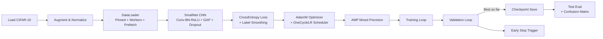

# CIFAR-10 CUDA-Optimized Deep Learning Trainer

## Executive Summary
Enterprises today are drowning in data, and the need for **faster, more efficient computing** is universal. This project demonstrates how to harness the **parallel power of NVIDIA GPUs** with PyTorch and CUDA to train image recognition models at scale.  

Instead of CPU bottlenecks, this trainer validates the **business case for GPU acceleration**:  
- Faster training = faster innovation  
- Lower hardware costs by maximizing GPU investment  
- Built-in reproducibility and automation  

Think of it as a **blueprint for scaling AI workloads**—from image classification today to more complex enterprise datasets tomorrow.

---

## Technical Summary
This repo contains a **production-minded PyTorch training pipeline** for the CIFAR-10 dataset (60,000 color images across 10 classes). It goes far beyond tutorial code:

- **Model**: Compact CNN (Conv-BN-ReLU blocks + Global Average Pooling + Dropout)  
- **Optimization**: `AdamW` optimizer + `OneCycleLR` scheduler for fast convergence  
- **Speed**: CUDA with **AMP (mixed precision)**, **TF32** (Ampere+ GPUs), cuDNN autotuning  
- **Data pipeline**: Augmentation (random crop/flip), pinned memory, persistent DataLoader workers  
- **Reliability**: Validation split, early stopping, best checkpoint saving  
- **Metrics**: Per-class accuracy and confusion matrix export  
- **CLI**: Flexible command-line arguments for epochs, batch size, learning rate, etc.  
- **Extensible**: Easily swap in ResNet or other backbones  

---

## System Overview


```mermaid
sequenceDiagram
  participant U as User
  participant D as DataLoader
  participant M as Model
  participant O as Optimizer+Scheduler
  participant A as AMP (autocast+GradScaler)
  participant V as Validator

  U->>D: Load CIFAR-10 + Augment/Normalize
  D->>M: Mini-batches to GPU
  loop Each Epoch
    M->>A: Forward pass (AMP autocast)
    A->>M: Backward pass (scaled gradients)
    M->>O: Optimizer + LR scheduler step
    U->>V: Run validation set
    V-->>U: Metrics (val_loss/acc, per-class)
    alt Best model
      U->>U: Save checkpoint
    else No improvement
      U->>U: Early stopping counter++
    end
  end
  U->>M: Load best checkpoint
  M->>U: Final test accuracy + confusion matrix
