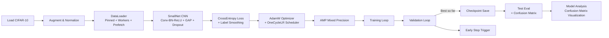
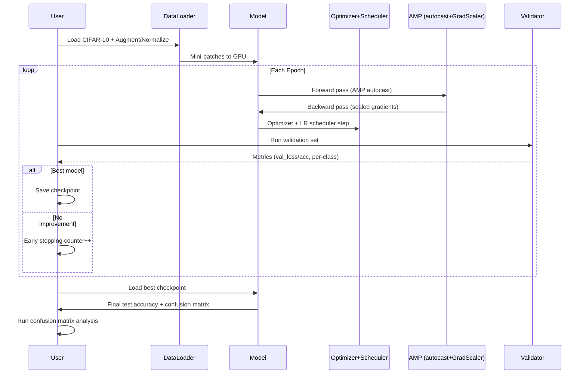

# CIFAR-10 CUDA-Optimized Deep Learning Trainer

## Executive Summary
Enterprises today are drowning in data, and the need for **faster, more efficient computing** is universal. This project demonstrates how to harness the **parallel power of NVIDIA GPUs** with PyTorch and CUDA to train image recognition models at scale. 

Instead of CPU bottlenecks, this trainer validates the **business case for GPU acceleration**: 
- Faster training = faster innovation 
- Lower hardware costs by maximizing GPU investment 
- Built-in reproducibility and automation 

Think of it as a **blueprint for scaling AI workloads**—from image classification today to more complex enterprise datasets tomorrow.

---

## Performance Results

**Achieved Test Accuracy**: 91.86% on CIFAR-10
- Training time: ~100 epochs with early stopping (RTX 4060)
- Per-class accuracy ranges from 82.60% (cats) to 94.90% (ships)
- Model size: Compact CNN with 256 final feature channels
- GPU utilization: Full CUDA acceleration with mixed precision

---

## Technical Summary
This repo contains a **production-minded PyTorch training pipeline** for the CIFAR-10 dataset (60,000 color images across 10 classes). It goes far beyond tutorial code:

- **Model**: Compact CNN (Conv-BN-ReLU blocks + Global Average Pooling + Dropout) 
- **Optimization**: `AdamW` optimizer + `OneCycleLR` scheduler for fast convergence 
- **Speed**: CUDA with **AMP (mixed precision)**, **TF32** (Ampere+ GPUs), cuDNN autotuning 
- **Data pipeline**: Augmentation (random crop/flip), pinned memory, persistent DataLoader workers 
- **Reliability**: Validation split, early stopping, best checkpoint saving 
- **Metrics**: Per-class accuracy and confusion matrix export 
- **CLI**: Flexible command-line arguments for epochs, batch size, learning rate, etc. 
- **Extensible**: Easily swap in ResNet or other backbones 

---

## Quick Start

### Prerequisites
- NVIDIA GPU with CUDA support (tested on RTX 4060)
- Python 3.11+ 
- Windows (PowerShell) or Linux terminal

### Environment Setup
```powershell
# Create project directory and navigate to it
mkdir your-project-name
cd your-project-name

# Create and activate virtual environment
python -m venv venv
.\venv\Scripts\activate  # Windows PowerShell
# source venv/bin/activate  # Linux/Mac

# Install CUDA-enabled PyTorch (crucial step)
pip install torch torchvision torchaudio --index-url https://download.pytorch.org/whl/cu118

# Verify GPU detection
python -c "import torch; print('CUDA available:', torch.cuda.is_available()); print('GPU:', torch.cuda.get_device_name(0) if torch.cuda.is_available() else 'None')"
```

### Training
```powershell
# Basic training (defaults: 100 epochs, batch_size=128, lr=3e-3)
python cifar10_cnn_cuda_optimized.py

# Custom parameters
python cifar10_cnn_cuda_optimized.py --epochs 50 --batch_size 256 --lr 0.001

# View all options
python cifar10_cnn_cuda_optimized.py --help
```

### Model Analysis
After training, analyze your model's behavior with the confusion matrix:

```powershell
# Install visualization dependencies
pip install matplotlib

# Run confusion matrix analysis
python Simple_Confusion_Matrix_Analysis.py
```

The analysis script will:
- **Load and display** the raw confusion matrix tensor
- **Generate a heatmap visualization** showing classification patterns
- **Identify common misclassifications** (e.g., cats confused with dogs)
- **Calculate per-class precision and recall** metrics
- **Reveal systematic biases** in the model's predictions

Example insights you'll discover:
- Animals (birds, cats) are harder to classify than vehicles
- Similar-looking classes get confused (cats ↔ dogs, deer ↔ horses)
- Clear separation between vehicles and animals shows good feature learning

---

## System Overview





---

## File Structure
```
your-project-name/
├── cifar10_cnn_cuda_optimized.py    # Main training script
├── Simple_Confusion_Matrix_Analysis.py  # Model analysis tool
├── venv/                             # Virtual environment
├── data/                             # CIFAR-10 dataset (auto-downloaded)
├── checkpoints/                      # Saved models and metrics
│   ├── smallnet_cifar10_best.pt      # Best model checkpoint
│   └── smallnet_cifar10_confmat.pt   # Confusion matrix tensor
└── README.md                         # This file
```

---

## Troubleshooting

### Common Issues

**"CUDA not available" error:**
- Ensure you installed the CUDA version: `pip install torch torchvision torchaudio --index-url https://download.pytorch.org/whl/cu118`
- Check GPU detection: `nvidia-smi`

**Virtual environment issues:**
- Make sure you see `(venv)` in your prompt
- Recreate if needed: `rm -rf venv && python -m venv venv`

**Import errors:**
- Verify you're in the correct directory and virtual environment
- Check installations: `pip list | findstr torch`

### Performance Tips
- Larger batch sizes utilize GPU memory more efficiently
- Mixed precision (enabled by default) provides 1.5-2x speedup
- Early stopping prevents overfitting and saves training time

---

## Results Interpretation

The confusion matrix visualization reveals model behavior patterns:

- **Diagonal dominance**: Strong classification accuracy
- **Off-diagonal clusters**: Systematic confusions between similar classes
- **Row/column patterns**: Classes that are consistently over/under-predicted

Use these insights to:
- Identify classes needing more training data
- Understand model limitations for deployment
- Guide architecture improvements for better performance

---

## Extensions

This foundation supports various enhancements:
- **Custom datasets**: Replace CIFAR-10 with your own image data
- **Model architectures**: Swap in ResNet, EfficientNet, or Vision Transformers
- **Advanced techniques**: Implement mixup, cutmix, or other augmentations
- **Deployment**: Export to ONNX for production inference

---

## Hardware Requirements

**Minimum**: 
- NVIDIA GPU with 4GB+ VRAM
- 8GB+ system RAM

**Recommended**: 
- Modern NVIDIA GPU (RTX 3060+) with 8GB+ VRAM
- 16GB+ system RAM
- SSD storage for faster data loading

**Tested On**:
- NVIDIA GeForce RTX 4060 (8GB VRAM)
- CUDA 12.9, PyTorch 2.7.1+cu118
